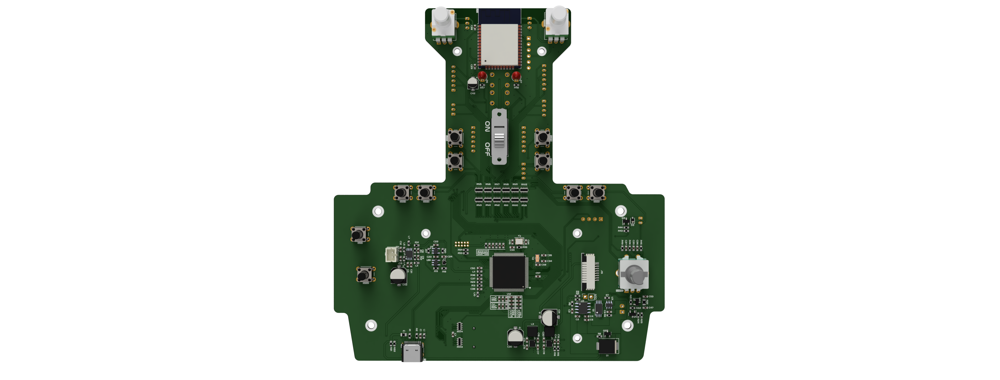

  <b>
   <h1>
      RadiolinkAT9C
   </h1>
   <h6>
     V1
   </h6>
  </b>

## What is this project?
My aim in this project, which I started as a hobby using the box of my broken Radiolink AT9 radio transmitter, was to control the drone in a simple way using the [ExpressLRS](https://github.com/ExpressLRS) module. In addition, I designed equipment that will contribute to my personal development. 
[For hardware information](Hardware.md);

I have personally reached the end of this project that I created with these goals. Even though it is not completely professional, I have created a remote control that will do the job. I made both the hardware and software files open source to guide beginners who want to make their own remote control. Who knows, maybe someone will make the code I wrote more meaningful :)

## Known bugs;
- [ ] DAC player has been disabled because it disrupts CRSF communication.
- [ ] I cannot refresh much on the main screen, the delay is too much.
- [ ] There is an error in the screen refresh when moving to the upper menu on the ExpressLRS settings page.
- [ ] I never looked at the battery reading section.

Goals for advanced level?
- [ ] The software must be converted to task structure with FreeRTOS.
- [ ] When I connect the USB, it should offer the option "charging or SIMULATOR" and continue according to my choice. An animation of the battery charging, maybe a current graph, and in the simulator, it goes into HID mode and communicates with the computer.
