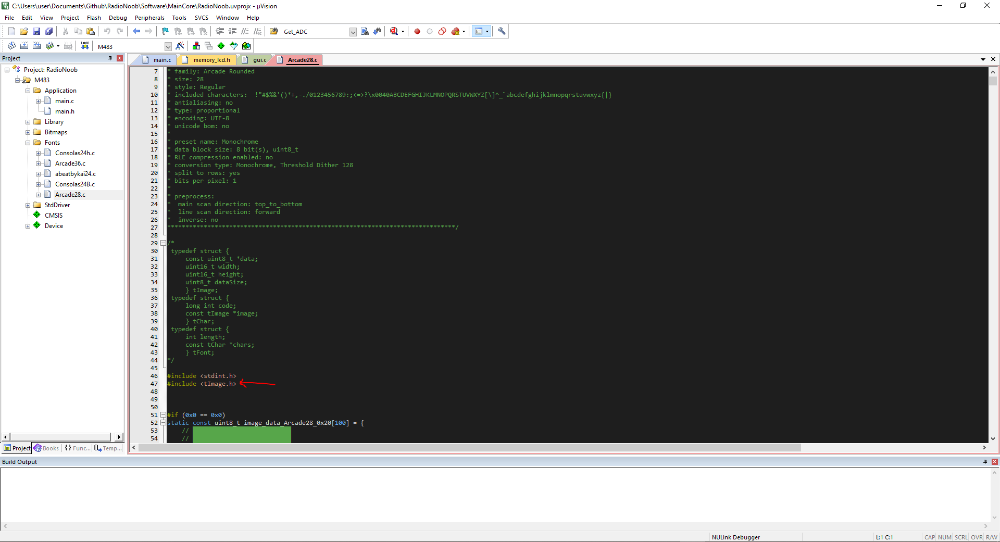

## How to convert pictures for monochrome sharp memory display?


1. First, open a word file and check whether the font you want to create is installed on your computer. The font sizes of the font you choose are important. Because you need to know this in order to be standard when giving a name. For example, the naming for an arial font of size 14 will be "Arial14". If I name it "Arial22", if there is no such size, I will have to create it again. If all checks ok you click to File -> New Font and Write to your selected Font Name.


2. 
* a Select font
* b Select font size
* c delete unused characters. It would be nice if unused characters are deleted as they will take up less space in memory.

and save


3. File -> Convert. Conversion options must be selected monochrome preset. [eg;](./bitmapConvert.md)


4. Save to font your font direction. File type must be selected `C source code (*.c)`


5. Add to upside `#include <tImage.h>` library header file


6. This is font name


7. Add to library memory_lcd.h file.

eg;
```C
GFXDisplayPutText(25, 50, &Arcade28, "00:00", BLACK);	
```