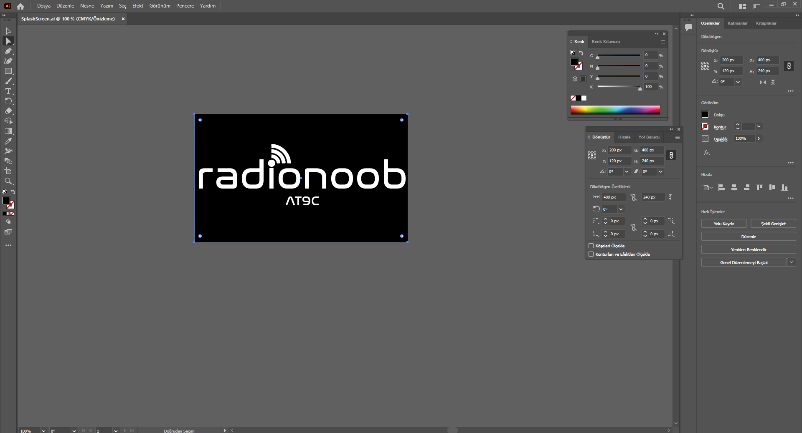
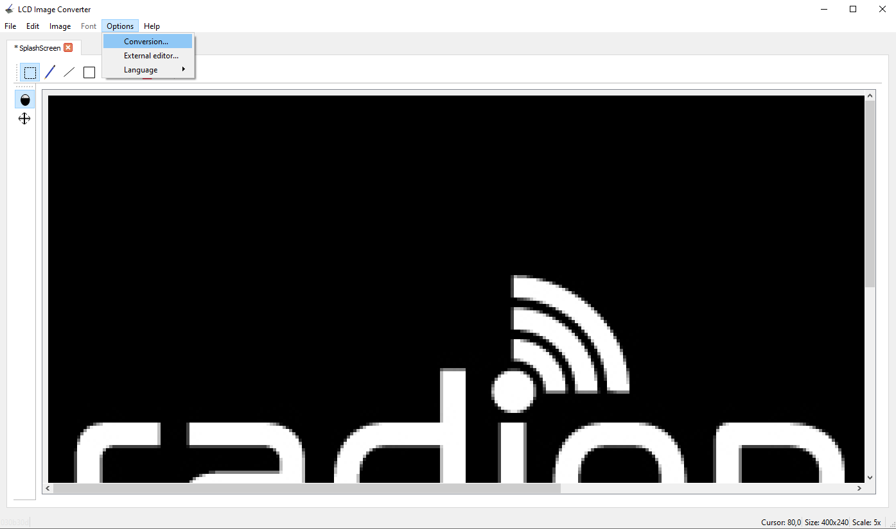
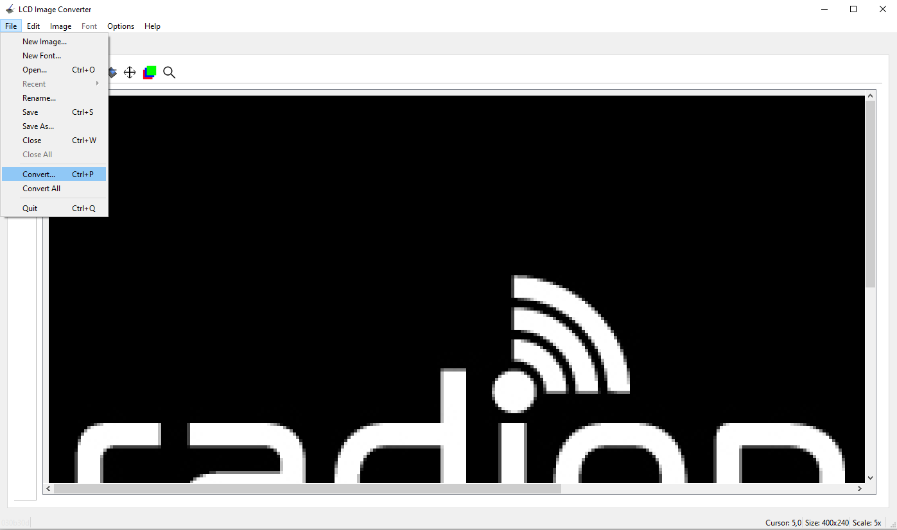
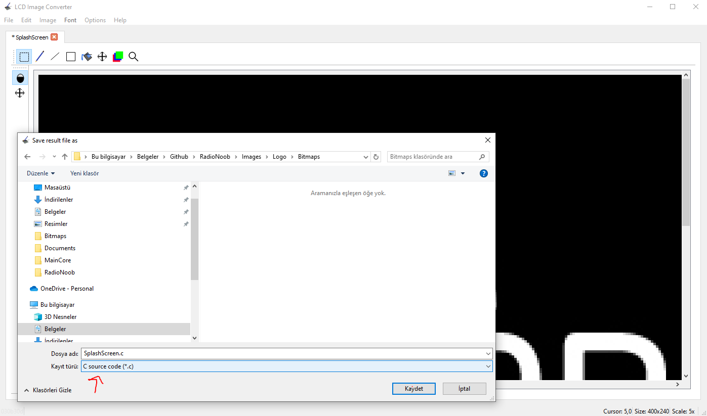
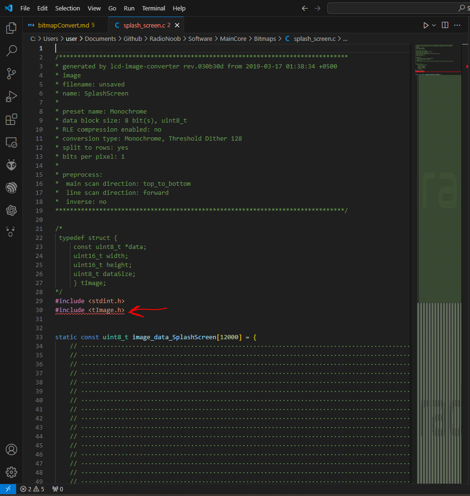
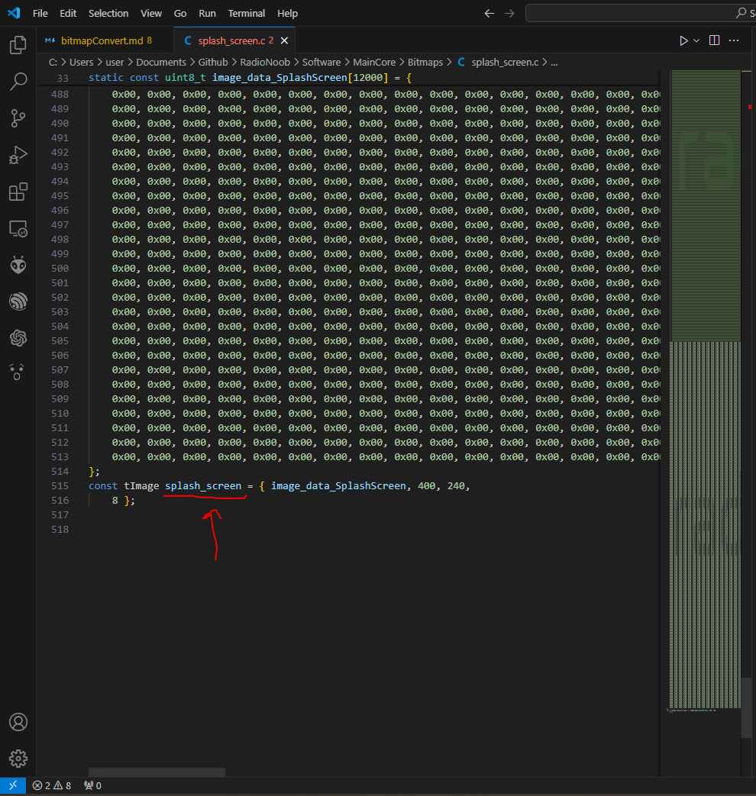
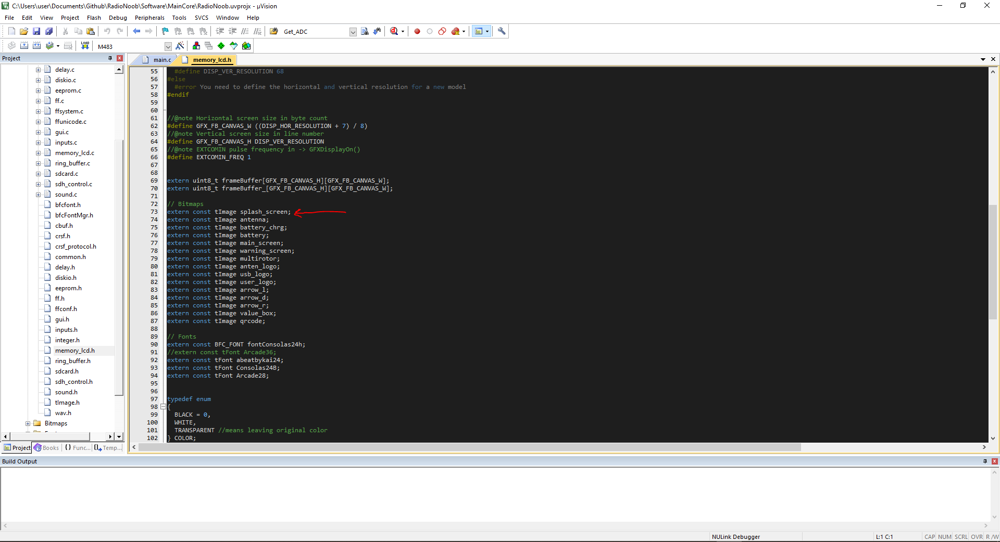

## How to convert pictures for monochrome sharp memory display?



1.) The dimensions of your work in the visual design program should not be larger than 400x240 pixels.


2.) And open the image .jpeg or .png doesn't matter. Enter the conversions setting from the options tab


3. Import to Monochrome.xml file.


4. Convert image


5. File settings must be `C source code(*.c)`


6. After open the converted file and add to up side `#include <tImage.h>`


7. This is c file name


8. It is ready for use after adding it to the memory_lcd.h file in the Library folder as shown in the figure.

ex. 
``` C
GFXDisplayPutImage(0, 0, &splash_screen, false);
```

